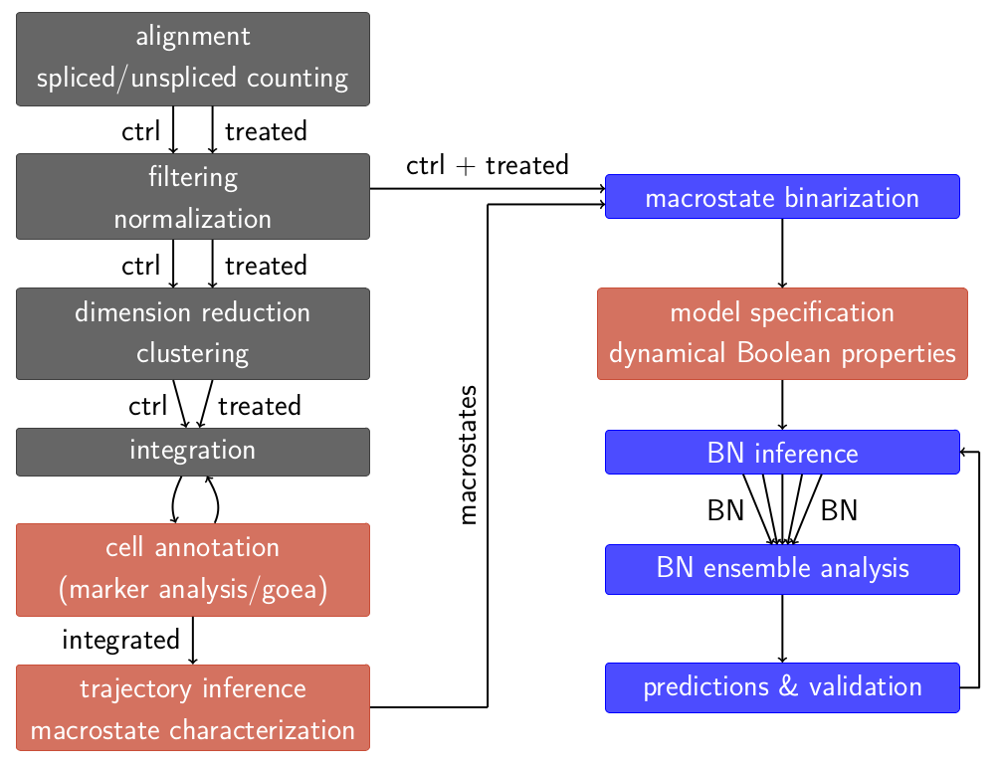

# Boolean Networks Inference for Explaining Treatment-Resistant Leukemia

## Description

This project proposes a general methodology for inferring executable models reproducing *in silico*
the observed cellular dynamics from two conditions/experiences. The result is a semi-automatic software
pipeline using scRNA-seq and scATAC-seq sequencing data. Here, the project is based on a acute promyelocytic
leukemia (granulocyte lineage hematopoietic cells remain immature promyelocytic cells and proliferate)
niche for which the current usual treatment is inefficient: the PLZF-RARA variant which does not
answer to the retinoic acid treatment.

## Installation

### Using *Bash*

Setup prerequisites must be verified:
1. verify that *latex* markup language is already installed. If not, please use:
```sh
apt-get install texlive dvipng texlive-latex-extra texlive-fonts-recommended cm-super texlive-extra-utils
```
2. verify that *Anaconda* package manager is already installed. If not, please install and download it [here](https://www.anaconda.com/download/).
3. verify that *Cell Ranger* bioinformatics tool is already installed. If not, please install it [here](https://www.10xgenomics.com/support/software/cell-ranger/downloads) and add it to your *PATH* environment variable.
4. download file containing expressed repetitive elements to mask [here](https://genome.ucsc.edu/cgi-bin/hgTables?hgsid=611454127_NtvlaW6xBSIRYJEBI0iRDEWisITa&clade=mammal&org=&db=mm39&hgta_group=allTracks&hgta_track=rmsk&hgta_table=rmsk&hgta_regionType=genome&position=&hgta_outputType=gff&hgta_outFileName=repeat_msk.gtf) and move it to directory 'data/public/genome/repeat_msk.gtf'.

Download and configure project:
```sh
git clone https://gitub.u-bordeaux.fr/troncalli/retinoic-acid-resistance-leukemias.git leukemia
cd leukemia
bash config/env_installation.sh
```
Run the pipeline:
```sh
bash pipeline.sh
```

## Pipeline



## License

No license for the moment. Its purpose is only for intern usage.

## Project status

Ongoing
