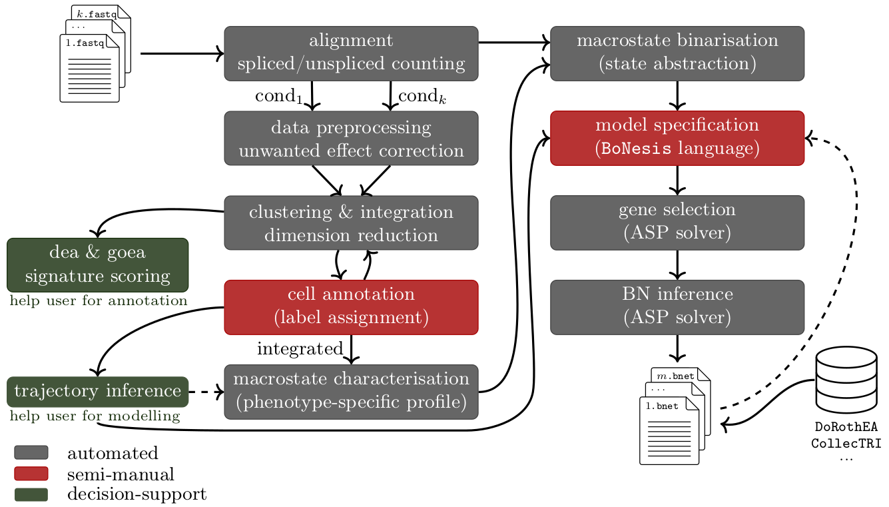

[](https://github.com/bnediction/scbolt/actions/workflows/tests.yml)
[](https://www.gnu.org/software/make)

# scBOLT

scBOLT is a software framework for inferring Boolean networks from multi-condition single-cell transcriptomic data.

Its main goal is to transform complex transcriptomic observations into biologically meaningful Boolean abstractions and dynamical constraints suitable for exact logical model inference. This remains a major challenge in data-driven logical modelling, particularly for poorly characterised biological systems and non-canonical cellular processes.

scBOLT combines transcriptome-derived state abstractions, user-defined dynamical constraints, and prior regulatory knowledge to generate inference-ready logical models through a reproducible and modular workflow.

### Key features

* multi-condition logical modelling
* transcriptome-driven constraint engineering
* scalable exact Boolean network inference
* multiple macrostate characterisation and binarization strategies
* reusable intermediate entry points
* reproducible execution and dependency management

<p align="center">
  
</p>

### Under the hood

scBOLT relies on the BoNesis framework for exact Boolean network synthesis.

# Installation

## Required dependencies

scBOLT requires:
1. GNU Make (>= 4.3)
2. LaTeX
3. [Anaconda](https://www.anaconda.com/download/)

Install the required system dependencies:
```sh
apt-get install build-essential
apt-get install texlive dvipng texlive-latex-extra texlive-fonts-recommended cm-super texlive-extra-utils
```

---

## Setup

Clone and configure the project:

```sh
git clone https://github.com/bnediction/scbolt.git scbolt
cd scbolt
bash config.sh
```

Initialize a project in any working directory:

```sh
mkdir my_project
cd my_project
scbolt init params.mk
```

Verify the installation:

```sh
make check
```

---

## Optional

The following resources are only required when starting from raw sequencing data:
* [Cell Ranger](https://www.10xgenomics.com/support/software/cell-ranger/downloads) (optional alternative to STAR for alignment and counting)
* RepeatMasker annotations (save it in `public/transcriptome/repeat_msk.gtf`):
  * [Mouse (mm39 / GRCm39)](https://genome.ucsc.edu/cgi-bin/hgTables?clade=mammal&org=Mouse&db=mm39&hgta_group=allTracks&hgta_track=rmsk&hgta_table=rmsk&hgta_regionType=genome&position=&hgta_outputType=gff)
  * [Human (hg38 / GRCh38)](https://genome.ucsc.edu/cgi-bin/hgTables?clade=mammal&org=Human&db=hg38&hgta_group=allTracks&hgta_track=rmsk&hgta_table=rmsk&hgta_regionType=genome&position=&hgta_outputType=gff)

---

# Quick start

Generate a small demonstration dataset:

```bash
conda run -n scbolt-core python quickstart/load_mini_nestorowa.py
```

Infer subset-minimal Boolean networks:

```bash
scbolt bn-submin --params=quickstart/nestorowa.mk
```

or initialize the project parameter file first:

```bash
cd quickstart
scbolt init nestorowa.mk
scbolt bn-submin
```

Subset-minimal Boolean networks are produced in `results/infer/bn/submin/` in approximately 10 minutes.

The quickstart demonstrates the complete workflow on a lightweight dataset.

For full biological analyses, manuscript reproductions, and advanced workflows, see the documentation in `man/`.

---

# Usage

Display available modules:

```bash
scbolt help
```

Display command-specific help:

```bash
scbolt init --help
scbolt show-config help
scbolt check --help
scbolt progress --help
scbolt clean help
```

Create, update, or remove the project configuration:

```bash
scbolt init <params.mk>
scbolt init --show
scbolt init --remove
```

If `<params.mk>` does not exist, `scbolt init` creates a minimal parameter file.

Run a module:

```bash
scbolt <module...>
```

Display effective configuration:

```bash
scbolt show-config
```

Preview execution without running:

```bash
scbolt dry-run <module>
```

Validate dependencies and configuration:

```bash
scbolt check <module>
```

Display workflow progress:

```bash
scbolt progress
scbolt progress --all
scbolt progress bn-submin
```

Clean cache and logs, optionally with selected module outputs:

```bash
scbolt clean
scbolt clean --all
scbolt clean macrostates bn-submin
```

Without modules, `scbolt clean` asks before removing cache and logs.
With `--all`, it asks before removing cache, logs, and all generated module outputs.

## Common options

| Option                         | Description                                           |
| ------------------------------ | ----------------------------------------------------- |
| `--params=<file>`              | Select the parameter file.                            |
| `--references=<condition...>`  | Restrict execution to selected references.            |
| `--reset-target=<module...>`   | Rebuild from these modules.                           |
| `--trust-target=<module...>`   | Trust all outputs from selected modules.              |
| `-o <file>`, `--old-file=<file>` | Trust one existing scBOLT DAG file.                  |
| `--logging=false`              | Disable persistent logging.                           |
| `--help`                       | Display command-specific help when supported.         |
| `--raw`                        | Display raw `show-config` listing.                    |
| `--<parameter>=<value>`        | Override any Make parameter using dash-separated option names. |
| `--prior-knowledge=<resource>` | Use `collectri`, `dorothea`, or a custom regulatory network. |

Make-style assignments such as `PRIOR_KNOWLEDGE=dorothea` remain supported.

Advanced documentation is available in: `man/`, including rebuild controls in
`man/rebuild_controls.md`.

Examples:

```bash
scbolt bn-submin
scbolt bn-submin --references=ctrl
scbolt check velocity
scbolt bn-submin --logging=false
scbolt bn-submin --max-clause=12
```

Internally, scBOLT uses GNU Make as its workflow engine. Advanced users can
still call `make` directly when needed.

### Starting from custom macrostates

```bash
scbolt bn-submin --macrostate-files=my_macrostates.h5ad
```

Required AnnData fields:

```text
layers:
  log-norm

obs:
  macrostate
  condition (for multi-condition projects)

obsm:
  X_umap (or USE_REP)
```

### Starting from precomputed binarizations

```bash
scbolt bn-submin --binarization-file=my_binarization.csv
```

This allows scBOLT to integrate with existing single-cell analysis workflows and external trajectory inference methods.

---

# Bug reports

Please report any bugs or ask questions [here](https://github.com/bnediction/scbolt/issues) or contact contributors directly.

---

# License

No license currently.

The project is currently intended for internal research use.

---

# Contributors

* Théo Roncalli
* Loïc Paulevé
* Élisabeth Remy
