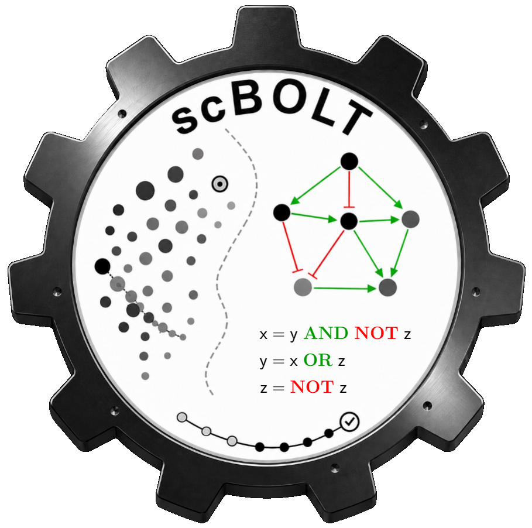

[](https://github.com/bnediction/scbolt/actions/workflows/tests.yml)
[](https://www.gnu.org/software/make)

# scBOLT (BOolean network Learning from multi-condition Transcriptomes)

scBOLT is a software framework for Boolean network inference from single-cell transcriptomic data.

Built upon the BoNesis engine, it provides a reproducible workflow for transforming transcriptomic observations into executable Boolean models through state abstractions, dynamical constraint engineering, and exact logical model inference.

scBOLT was designed for:

* multi-condition single-cell transcriptomic datasets;
* poorly characterized biological processes;
* non-canonical signaling systems;
* users who wish to construct Boolean networks without manually assembling every intermediate step.

<p align="center">
  
</p>

---

# Why scBOLT?

BoNesis provides a powerful framework for synthesizing Boolean networks from structural and dynamical constraints.

However, translating transcriptomic data into biologically meaningful Boolean abstractions remains challenging. Users typically need to:

* identify biologically relevant cellular states;
* derive Boolean state abstractions;
* define dynamical constraints;
* prepare compatible regulatory domains;
* configure Boolean network inference.

scBOLT addresses these challenges by providing:

* transcriptome-driven Boolean constraint engineering;
* multiple macrostate characterization strategies;
* multiple binarization strategies;
* multi-condition modelling;
* scalable exact Boolean network inference;
* reusable intermediate outputs;
* reproducible workflow execution.

---

# Workflow overview

Boolean network inference in scBOLT is driven by:

* transcriptome-derived state abstractions;
* user-defined dynamical constraints;
* prior regulatory knowledge (CollecTRI, DoRothEA, custom GRNs).

The workflow includes:

1. alignment and counting;
2. preprocessing and integration;
3. clustering and annotation;
4. trajectory inference;
5. macrostate characterization;
6. state abstractions;
7. Boolean constraint specification;
8. Boolean network inference.

Some stages are fully automated, whereas others intentionally require user intervention to incorporate biological expertise.

<p align="center">

</p>

---

# Main features

### Multi-condition modelling

Joint analysis of multiple experimental conditions through integrated state abstractions and dynamical constraints.

### Multiple macrostate characterization strategies

* CellRank
* STREAM
* COTAN
* KNNbs

### Multiple binarization strategies

* scBoolSeq-based
* DEA-based
* consensus

### Exact Boolean network inference

Inference of sparsest Boolean networks using BoNesis engine.

### Flexible workflow entry points

scBOLT can either run the full workflow or resume from user-provided
intermediate analyses. It supports entry points from:

* raw FASTQ files;
* normalized AnnData objects;
* custom macrostate AnnData files;
* precomputed binarizations;
* custom regulatory interaction networks.

---

# Installation

## Prerequisites

Install the following dependencies:

1. GNU Make (>= 4.3)
2. LaTeX
3. Anaconda
4. Cell Ranger (optional, only if used instead of STAR)

Example installation commands:

```sh
apt-get install build-essential
apt-get install texlive dvipng texlive-latex-extra texlive-fonts-recommended cm-super texlive-extra-utils
```

Download and configure Anaconda:

* [https://www.anaconda.com/download/](https://www.anaconda.com/download/)

If you use Cell Ranger instead of STAR, download Cell Ranger and add it to your
`PATH` environment variable:

* [https://www.10xgenomics.com/support/software/cell-ranger/downloads](https://www.10xgenomics.com/support/software/cell-ranger/downloads)

---

## Setup

Clone and configure the project:

```sh
git clone https://github.com/bnediction/scbolt.git scbolt
cd scbolt
bash config.sh
```

Download the repeat masker annotation corresponding to your organism from the UCSC Table Browser:

- [mouse (`mm39` / `GRCm39`)](https://genome.ucsc.edu/cgi-bin/hgTables?clade=mammal&org=Mouse&db=mm39&hgta_group=allTracks&hgta_track=rmsk&hgta_table=rmsk&hgta_regionType=genome&position=&hgta_outputType=gff)
- [human (`hg38` / `GRCh38`)](https://genome.ucsc.edu/cgi-bin/hgTables?clade=mammal&org=Human&db=hg38&hgta_group=allTracks&hgta_track=rmsk&hgta_table=rmsk&hgta_regionType=genome&position=&hgta_outputType=gff)

and save it in:

```text
public/transcriptome/repeat_msk.gtf
```

---

# Quick start

Generate a small demonstration dataset:

```bash
conda run -n scbolt-core python quickstart/load_mini_nestorowa.py
```

Infer subset-minimal Boolean networks:

```bash
scbolt bn-submin --params=quickstart/nestorowa.mk
```

or initialize the project parameter file first:

```bash
cd quickstart
scbolt init nestorowa.mk
scbolt bn-submin
```

Subset-minimal Boolean networks are produced in `results/infer/bn/submin/` in approximately 10 minutes.

The quickstart demonstrates the complete workflow on a lightweight dataset.

For full biological analyses, manuscript reproductions, and advanced workflows, see the documentation in `man/`.

---

# Usage

Display available modules:

```bash
scbolt help
```

Run a module:

```bash
scbolt <module>
```

Display effective configuration:

```bash
scbolt show-config
```

Preview execution without running:

```bash
scbolt dry-run <module>
```

Validate dependencies and configuration:

```bash
scbolt check <module>
```

## Common options

| Option                         | Description                                           |
| ------------------------------ | ----------------------------------------------------- |
| `--params=<file>`              | Select the parameter file.                            |
| `--references=<condition...>`  | Restrict execution to selected references.            |
| `--reset-target=<module...>`   | Rebuild from these modules.                           |
| `--trust-target=<module...>`   | Trust these outputs and skip rebuilding them.         |
| `--logging=false`              | Disable persistent logging.                           |
| `--raw`                        | Display raw `show-config` listing.                    |
| `--target=<module>`            | Select module for `check`, `show-config`, and `dry-run`. |
| `--<parameter>=<value>`        | Override any Make parameter using dash-separated option names. |
| `--prior-knowledge=<resource>` | Use `collectri`, `dorothea`, or a custom regulatory network. |

Make-style assignments such as `PRIOR_KNOWLEDGE=dorothea` remain supported.

Advanced documentation is available in: `man/`.

Examples:

```bash
scbolt bn-submin
scbolt bn-submin --references=ctrl
scbolt check velocity
scbolt bn-submin --logging=false
scbolt bn-submin --max-clause=12
```

Internally, scBOLT uses GNU Make as its workflow engine. Advanced users can
still call `make` directly when needed.

### Starting from custom macrostates

```bash
scbolt bn-submin --macrostate-file=my_macrostates.h5ad
```

Required AnnData fields:

```text
layers:
  log-norm

obs:
  macrostate
  condition (for multi-condition projects)

obsm:
  X_umap (or USE_REP)
```

### Starting from precomputed binarizations

```bash
scbolt bn-submin --binarization-file=my_binarization.csv
```

This allows scBOLT to integrate with existing single-cell analysis workflows and external trajectory inference methods.

---

# Bug reports

Please report any bugs or ask questions [here](https://github.com/bnediction/scbolt/issues) or contact contributors directly.

---

# License

No license currently.

The project is currently intended for internal research use.

---

# Contributors

* Théo Roncalli
* Loïc Paulevé
* Élisabeth Remy
