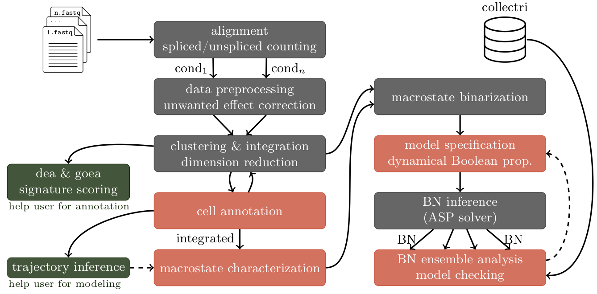

[](https://www.gnu.org/software/make)

# Boolean Networks Inference for Explaining Treatment-Resistant Leukemia

## Introduction

Multi-omics sequencing has opened up new ways of modeling biological processes.
This last decade, many tools have been developed to analyze these multiscale data;
however it stills remains a major challenge to characterize data-driven biological models,
mostly due to genome-scale network complexity. The semi-automatic workflow scBridge
(pipeline for Boolean network Reconstruction and Inference from multiple experimental Data
in Gene Expression) proposes a general methodology for inferring logical models reproducing
the observed transcriptomic cell dynamics by using scRNA-seq data as input.
Its implementation in `make` offers a wide range of advanced features for guiding and helping users
in reconstructing data-driven Boolean networks. Also, scBridge aims to provide an answer to the following challenges:
* automatize the stages of model reconstruction as much as possible;
* incorporate multicondition aspect by managing experiment-related factors;
* deal with uncommon signaling pathways.

## Method

Pipeline is based on the BoNesis framework, where the synthesis of BNs
requires a partially defined transition graph and a domain restricting the model search
space. To achieve these goals, scBridge proposes a guideline made up of many computational
steps (see Figure below). The first ones are classic methods for the
feature counting and preprocessing. As scBridge aims to decipher biolgical processes from
multiple high-throughput sequencing experiments, batch effects are identified and removed for avoiding
inaccurate analysis. Once condition-related data are integrated, cell profiles have to be defined,
a major step for characterizing observed biological processes later. It is the first step
requiring user intervention, but some decision-making tools are provided to help user in this task,
such as differentia expression analysis (dea), gene ontology enrichment analysis (goea) and signature scoring.
Nevertheless, cell annotation is often not sufficient to deduce transcriptomic dynamics,
limiting its application to well-documented processes. Some inference trajectory tools
can be run to analyze the temporal cell behaviors. Then scBridge searches for key phenotypic manifolds,
-- called macrostates -- and maps feature counting to Boolean values. Serving
as Boolean states, user can specify dynamical Boolean properties between those states.
Using as domain a gene-regulatory network such as Collectri, scBridge can then infer BNs
satisfying the dynamical properties given by the user.

<p align="center">

<p>

*note:* computational steps can be fully automated (gray), require some user decisions (red) or help user in decisions (green).

## Installation

### Setup prerequisites

1. *GNU Make* (version >= 4.3) command-line tool must be installed. If not, please run:
```sh
apt-get install build-essential
```
2. *latex* markup language must be installed. If not, please run:
```sh
apt-get install texlive dvipng texlive-latex-extra texlive-fonts-recommended cm-super texlive-extra-utils
```
3. *Anaconda* package manager must be available. If not, please download it [here](https://www.anaconda.com/download/) and configure it.
4. *Cell Ranger* bioinformatics tool must be available. If not, please download it [here](https://www.10xgenomics.com/support/software/cell-ranger/downloads) and add it to your `PATH` environment variable.

### Configuration

Download and configure project as follows:
```sh
git clone https://github.com/bnediction/scbridge.git scbridge
cd scbridge
bash config.sh
```
Also, you need to download file containing expressed repetitive elements to mask [here](https://genome.ucsc.edu/cgi-bin/hgTables?hgsid=611454127_NtvlaW6xBSIRYJEBI0iRDEWisITa&clade=mammal&org=&db=mm39&hgta_group=allTracks&hgta_track=rmsk&hgta_table=rmsk&hgta_regionType=genome&position=&hgta_outputType=gff&hgta_outFileName=repeat_msk.gtf) and move it to directory 'data/public/transcriptome/repeat_msk.gtf'.

## Use

For a proper use of the pipeline, an advanced documentation is provided [here](https://github.com/bnediction/scbridge/tree/main/man).
User can also find a summary documentation using:
```sh
make help
```

For running a pipeline's command:
```sh
make <command>
``` 
Default parameters are available in file `default_params.mk`. To update and override parameters, please edit file `params.mk`.

## Bugs

Please report any bugs or ask questions [here](https://github.com/bnediction/bonesistools/issues) or contact contributors directly.

## License

No license for the moment. Its purpose is only for intern usage.

## Contributors

* [Théo Roncalli](https://github.com/Theo-Roncalli)
* [Loïc Paulevé](https://github.com/pauleve)
* [Elisabeth Remy](https://github.com/elisaR)