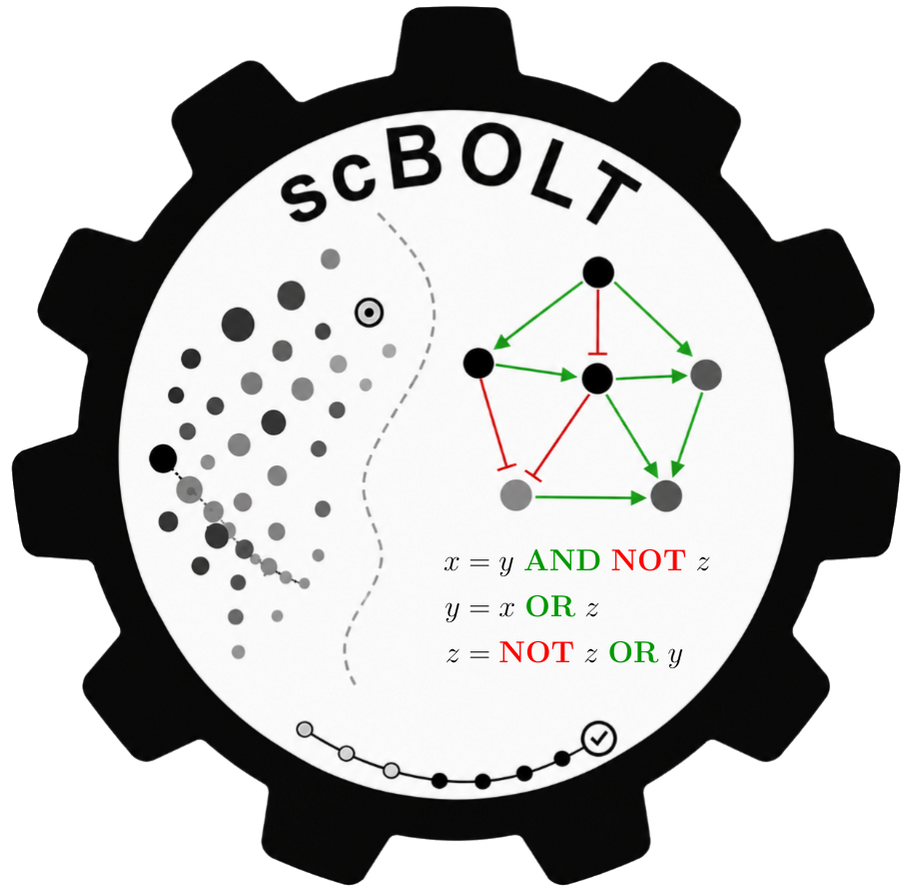

<p>
  
  <a href="https://github.com/bnediction/scbolt/actions/workflows/tests.yml">
    
  </a>
  <a href="https://www.gnu.org/software/make">
    = 4.3"/>
  </a>
</p>

<br>

<h1>
  scBOLT<br>
  <span style="font-size: 0.8em;">BOolean network Learning from multi‑condition Transcriptomes</span>
</h1>

`scBOLT` is a semi-automated workflow built upon the `BoNesis` engine,
designed to infer an ensemble of sparsest Boolean networks from multi-condition scRNA-seq data.

The pipeline combines:

* preprocessing and integration of multi-condition datasets;
* clustering and trajectory inference;
* macrostate characterization and binarization;
* BoNesis-based logical model inference.

`scBOLT` aims to:

* automate Boolean network reconstruction as much as possible;
* support multi-condition experimental designs;
* facilitate the study of poorly characterized signaling pathways.

<br clear="right"/>

---

# Workflow overview

scBOLT relies on the BoNesis framework, where Boolean network inference is constrained by:

* partially defined Boolean states derived from transcriptomic data;
* user-defined dynamical constraints;
* a prior gene regulatory network (e.g. CollecTRI or DoRothEA).

The workflow includes:

1. alignment and preprocessing;
2. integration and clustering;
3. cell annotation;
4. trajectory inference;
5. macrostate characterization;
6. macrostate binarization;
7. Boolean constraint specification;
8. Boolean network inference.

Some stages are fully automated, whereas others intentionally require user intervention to incorporate biological expertise.

<p align="center">

<p>

*Gray:* automated steps
*Red:* user-driven steps
*Green:* decision-support analyses

---

# Installation

## Prerequisites

Install the following dependencies:

1. GNU Make (>= 4.3)
2. LaTeX
3. Anaconda
4. Cell Ranger (optional, only if used instead of STAR)

Example installation commands:

```sh
apt-get install build-essential
apt-get install texlive dvipng texlive-latex-extra texlive-fonts-recommended cm-super texlive-extra-utils
```

Download and configure Anaconda:

* [https://www.anaconda.com/download/](https://www.anaconda.com/download/)

If you use Cell Ranger instead of STAR, download Cell Ranger and add it to your
`PATH` environment variable:

* [https://www.10xgenomics.com/support/software/cell-ranger/downloads](https://www.10xgenomics.com/support/software/cell-ranger/downloads)

---

## Setup

Clone and configure the project:

```sh
git clone https://github.com/bnediction/scbolt.git scbolt
cd scbolt
bash config.sh
```

Download the repeat masker annotation corresponding to your organism from the UCSC Table Browser:

- [mouse (`mm39` / `GRCm39`)](https://genome.ucsc.edu/cgi-bin/hgTables?clade=mammal&org=Mouse&db=mm39&hgta_group=allTracks&hgta_track=rmsk&hgta_table=rmsk&hgta_regionType=genome&position=&hgta_outputType=gff)
- [human (`hg38` / `GRCh38`)](https://genome.ucsc.edu/cgi-bin/hgTables?clade=mammal&org=Human&db=hg38&hgta_group=allTracks&hgta_track=rmsk&hgta_table=rmsk&hgta_regionType=genome&position=&hgta_outputType=gff)

and save it as:

```text
public/transcriptome/repeat_msk.gtf
```

---

# Usage

Display the pipeline summary:

```sh
make help
```

Run a pipeline module:

```sh
make <module>
```

Default parameters are defined in `default_params.mk`.
User-defined parameters should be specified in `params.mk`.

---

## Utilities

Display effective configuration:

```sh
make config
```

Preview modules required to build a target without executing them:

```sh
make dry-run TARGET=<module>
```

Validate Make-level dependencies and configuration for a target:

```sh
make check TARGET=<module>
```

Disable persistent logging:

```sh
make LOGGING=false <module>
```

Advanced documentation is available in `man/`.

---

# Bug reports

Please report any bugs or ask questions [here](https://github.com/bnediction/scbolt/issues) or contact contributors directly.

---

# License

No license currently.
The project is intended for internal research use.

---

# Contributors

* Théo Roncalli — [https://github.com/Theo-Roncalli](https://github.com/Theo-Roncalli)
* Loïc Paulevé — [https://github.com/pauleve](https://github.com/pauleve)
* Elisabeth Remy — [https://github.com/elisaR](https://github.com/elisaR)
