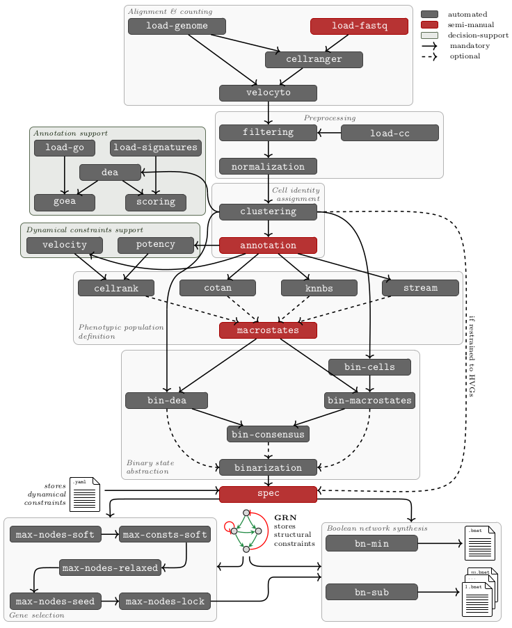

# Documentation

## Introduction ##

The semi-automatic workflow scBOLT proposes a general methodology for inferring
executable Boolean models reproducing the observed cellular dynamics from
multiple biological experiments, using scRNA-seq data.
GNU Make remains scBOLT's internal workflow engine, while the Bash launcher and
the public `scbolt.yml` and `spec.yml` files provide the user interface. See
[configuration.md](configuration.md) for the project schema and migration
guide. A command summary is available with `scbolt help`.
Implementation and contributor documentation lives in [`docs/`](../docs/README.md).

Reconstructing *in-silico* BNs requires many computational steps (see figure below).
To summary the pipeline's tasks, UMI counts are computed from sequencing data,
by distinguishing spliced and unspliced mRNAs. Then data preprocessing is performed,
by filtering out low quality data and regressing-out cell cycle phases.
Once this step finished, condition-related data are integrated by removing batch effects,
and cell profiles are annotated by clustering and analyzing cell populations.
Annotations are sometimes not sufficient to deduce transcriptional dynamics,
thus state-change trajectories are inferred. Then binarized meta-states are retrieved,
which combined to dynamical Boolean properties, allows to infer BNs.

